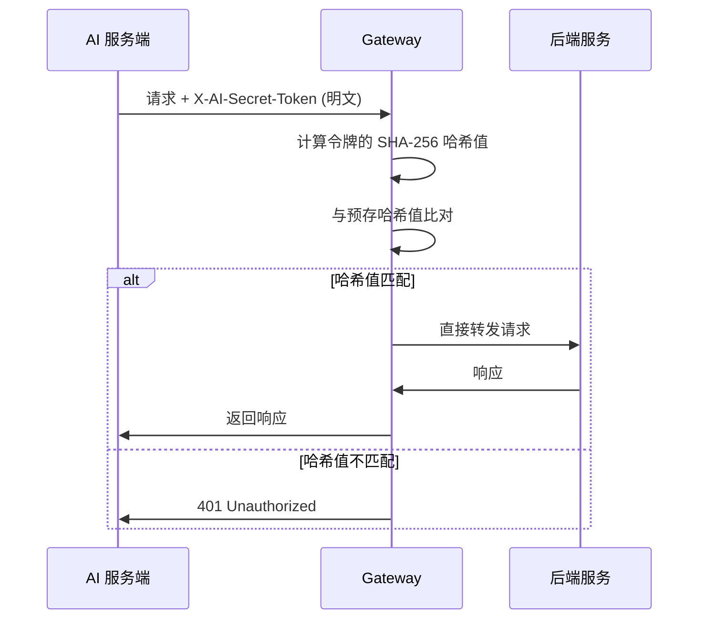

# AI 服务端专用令牌说明

## 概述

网关 `AuthGlobalFilter` 新增 AI 服务端专用通道，允许受信任的 AI 服务端绕过 JWT 验证直接访问后端服务。

## 安全设计

### 1. 哈希验证机制
- **Java 端存储**：仅存储令牌的 SHA-256 哈希值（单向不可逆）
- **AI 端持有**：明文令牌
- **验证流程**：收到请求时，计算请求令牌的 SHA-256 哈希值，与预存哈希值比对

### 2. 安全性保障
- ✅ **防反编译**：即使 jar 包被反编译，攻击者也只能看到哈希值，无法还原原始令牌
- ✅ **防暴力破解**：64 字符的强随机令牌（包含大小写字母、数字、特殊字符），暴力破解几乎不可能
- ✅ **防中间人攻击**：建议配合 HTTPS 使用，防止令牌在传输过程中被窃取
- ✅ **独立通道**：与普通用户的 JWT 验证完全隔离，不影响现有鉴权逻辑

## 使用方法

### AI 服务端发起请求

在请求头中携带以下令牌：

```http
X-AI-Secret-Token: 0ARFsoLQyn9QlwkMwd20lcm71O5cOf2P+GvVexdYETQRNKaq+zZCsj2GQGO6cqYC
```

### 完整请求示例

```bash
curl -X POST https://your-gateway.com/api/some-service/endpoint \
  -H "X-AI-Secret-Token: 0ARFsoLQyn9QlwkMwd20lcm71O5cOf2P+GvVexdYETQRNKaq+zZCsj2GQGO6cqYC" \
  -H "Content-Type: application/json" \
  -d '{"data": "your payload"}'
```

## 令牌信息

| 项目 | 值 |
|------|-----|
| **请求头名称** | `X-AI-Secret-Token` |
| **明文令牌**（供 AI 端使用） | `0ARFsoLQyn9QlwkMwd20lcm71O5cOf2P+GvVexdYETQRNKaq+zZCsj2GQGO6cqYC` |
| **SHA-256 哈希值**（Java 端存储） | `64e88dffd0ddd834b503fe609f4046e914833a18946628c33cccf8a22b739ef0` |
| **令牌长度** | 64 字符 |
| **字符集** | Base64（包含大小写字母、数字、+、/、=） |

## 验证流程



## 代码位置

- **Filter 类**：`com.link.gateway.filter.AuthGlobalFilter`
- **哈希值常量**：`AuthGlobalFilter.AI_TOKEN_HASH`
- **验证方法**：`AuthGlobalFilter.verifyAiToken(String)`

## 重要提示

### ⚠️ 令牌保管
- **明文令牌**必须妥善保管，仅 AI 服务端持有
- 不要将明文令牌提交到代码仓库
- 建议使用环境变量或密钥管理服务存储

### ⚠️ 传输安全
- **必须使用 HTTPS**，防止令牌在传输过程中被截获
- 考虑在生产环境启用 IP 白名单，限制 AI 服务端的访问来源

### ⚠️ 令牌轮换
如需更换令牌（疑似泄露或定期轮换）：

1. 生成新的强随机令牌
2. 计算新令牌的 SHA-256 哈希值
3. 更新 `AuthGlobalFilter.AI_TOKEN_HASH` 常量
4. 重新部署网关服务
5. 通知 AI 服务端使用新令牌

### ⚠️ 审计日志
- 网关会记录所有 AI 令牌验证的成功/失败日志
- 定期检查日志，发现异常访问及时处理

## 性能说明

- **SHA-256 计算开销**：每次请求约 0.1-0.5ms，对性能影响极小
- **无数据库查询**：哈希值硬编码在代码中，无额外 I/O 开销
- **优先级最高**：AI 令牌验证优先于白名单和 JWT 验证，匹配后立即放行

## 进阶优化建议

如果未来需要更高的安全性，可以考虑：

1. **双向 TLS（mTLS）**：AI 服务端和网关之间使用客户端证书认证
2. **时间戳 + 签名**：请求携带时间戳，使用非对称加密签名，防重放攻击
3. **令牌轮换机制**：支持多个有效令牌并发存在，实现零停机轮换
4. **IP 白名单**：在网关层限制只有特定 IP 可以使用 AI 令牌
5. **限流保护**：对 AI 令牌请求单独限流，防止滥用

---

**生成时间**：2026-08-26  
**维护者**：网关团队
